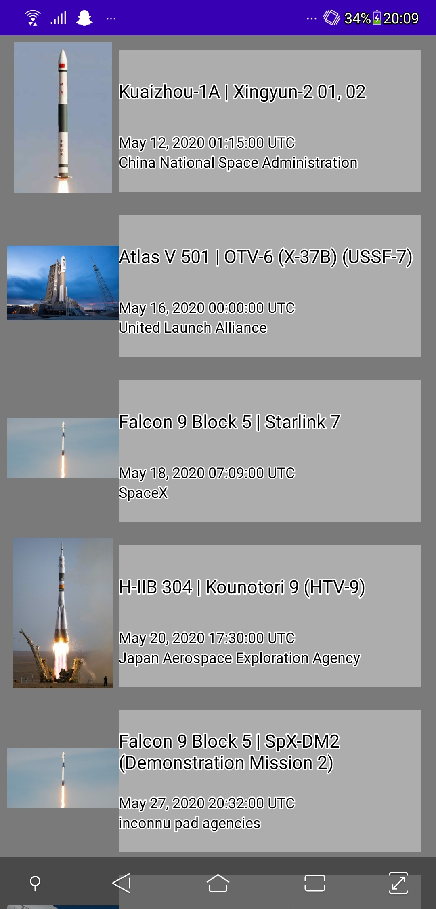
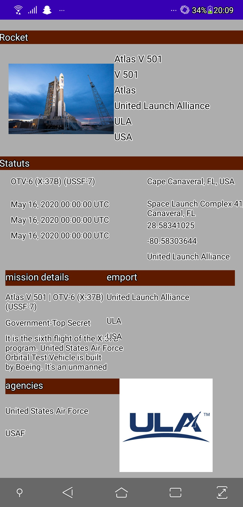

# SpaceLaunch_appli

## Presentation
application afficahnt les prochain decollage de fusée prévu avec l'heure de decollage , les information sur la fusée et sa mission, ainsi que
localisation du pad de tire et de l'agence acteur du tire

## consigne 
Ecran avec une liste d’éléments.
Ecran avec le détail d’un élément.
Appel WebService à une API Rest.
Stockage de données en cache
## Screens

  screen de la liste des decollage a venir
  

  

  

pour ouvrir la page detail il faut appuyer sur l'image de la Fusée

 

ce qui permet d'afficher des donnée complémentaire contenu dans notre fichier , qui detail le type de fusée , l'agence de construction, sa mission, la localisation du pas de tir , l'agence de se pas de tire , la mission de l'emport l'agence a qui appartient l'emport , et l'agence gérant le lancement 
